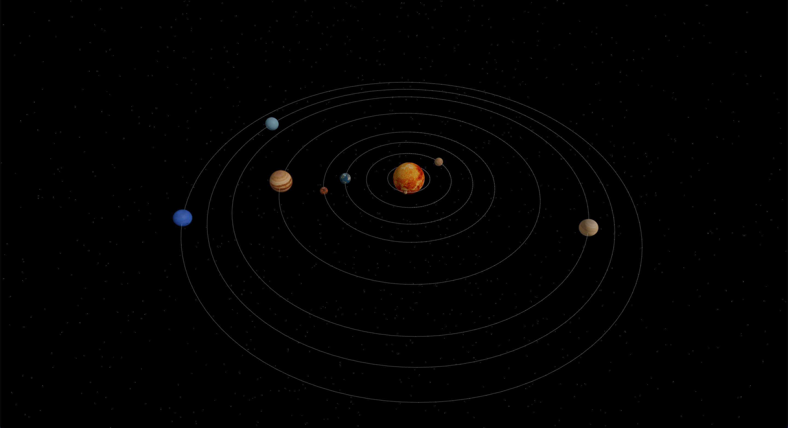

# Space Explorer

## Preview

## Overview

Space Explorer is an interactive 3D visualization of the solar system, featuring eight planets orbiting around the sun. The project focuses on real-time rendering, smooth animations, and scene composition using modern React-based Three.js libraries.

## Features

- Animated planetary orbits
- Interactive camera and scene controls
- Optimized rendering performance for the web

## Tech Stack

- **React**
- **Vite**
- **Three.js**
- **React Three Fiber**
- **React Three Drei**

## Purpose

This project was built as a personal experiment to explore 3D graphics, animations, and WebGL concepts within the React ecosystem.
